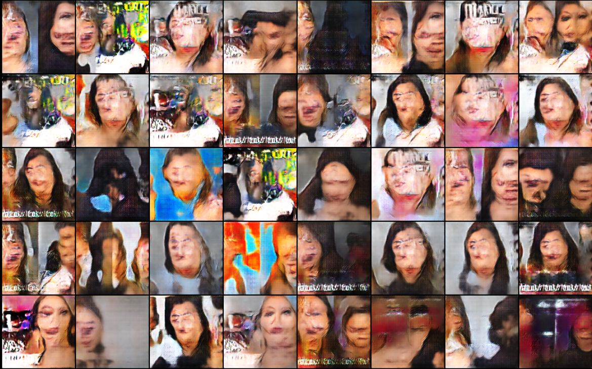

# Ganfluencer
Experimenting with GANs to generate 'beauty influencer' YouTube thumbnails. This repo contains code associated with my blog 
post ['Ganfluencer: Generating Beauty Influencers using GANs'](https://ekwska.github.io/ganfluencer/).



# Installation
It is recommended to use a virtual environment to install your packages to. An `environment.yml` is provided in this 
repo for the use with `conda`.

1. Create conda environment using `environment.yml`. Skip this step and activate your environment if you are using a 
different manager. Make sure that it uses `Python 3.7`.
    ```bash
    $ conda env create -f environment.yml
    $ conda activate ganfluencer
    ```

2. Install requirements into your environment.
    ```bash
    $ pip install -r requirements.txt
    ```
3. Install the `ganfluencer` package in develop mode.
    ```bash
    $ python setup.py develop
    ```

Now you are ready to train!

# Training
## Config file
In order to train the model on your own data, you can modify the config files found in `config` to change the parameters
such as number of epochs and batch size. Let's look at the file `config/dcgan_config.json` as an example.

```json
{
  "data_root": "data/",
  "log_dir": "logs/dcgan",
  "model": "dcgan",
  "workers": 2,
  "batch_size": 128,
  "img_size": 64,
  "n_channels": 3,
  "z_dim": 100,
  "f_depth_gen": 64,
  "f_depth_discrim": 64,
  "n_epochs": 200,
  "lr_gen": 0.0002,
  "lr_discrim": 0.0002,
  "beta_1": 0.5,
  "beta_2": 0.5,
  "n_gpu": 1,
  "log_interval": 100
}
```

The most important parameters for your training are:

* `data_root`: This is the directory where your data is saved. make sure all images are in this directory and not in 
sub-folders.
* `log_dir`: This is the directory where your tensorboard summaries and training output images will be written. Tensorboard
summaries are recorded every epoch, and training images are saved every `log_interval` so you can visually inspect progress.
* `model`: This is the model you will train with, either `dcgan` or `bigdcgan`. The models are identical apart from the fact
that `bigdcgan` has an extra convolutional layer. The larger model will take slightly longer to train because of this.

## Running training
Make sure you have your virtual environment active. You can then execute training when you are happy with your 
parameters using the command:

```bash
$ python scripts/run_dcgan_training --config/your_config_file.json
```

# Dataset access
I have not yet hosted the dataset that I have scraped off YouTube, but if I do I will share the link here. Otherwise, 
you can use the code in `ganfluencer/scraper.py` to scrape your own. You will need a YouTube API key, which you can 
get by following the instructions on the [YouTube Developers page](https://developers.google.com/youtube/v3/getting-started).

# Support
Please open an issue with any bugs or feature requests that you have found 🐞. 